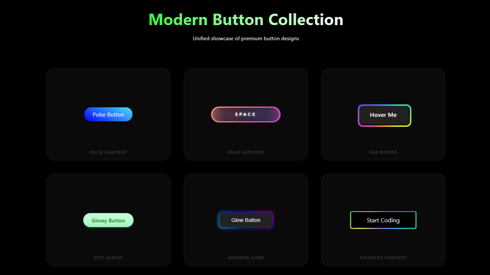

# Modern Button Collection

A professional, curated collection of modern, interactive button designs built with pure HTML and CSS. This project showcases a variety of styles, from glowing gradients to space-themed animations, all optimized for high-performance and seamless integration.



## 🚀 Features

- **Consolidated UI:** All designs are unified into a single, high-performance dashboard.
- **Pure CSS/HTML:** No external libraries or heavy dependencies.
- **Responsive Grid:** Adapts beautifully to various screen sizes.
- **Interactive Effects:** includes pulse gradients, starfield animations, and RGB border rotations.
- **Dark Mode Optimized:** Designed specifically for deep black (#000) aesthetics.

## 🛠️ Included Designs

1. **Pulse Gradient:** A smooth, breathing gradient effect.
2. **Space Explorer:** An immersive button with starfield and glow animations.
3. **RGB Border:** A sleek, rotating multicolor border.
4. **Soft Glossy:** A clean, tactile green design with subtle shadows.
5. **Rainbow Glow:** A vibrant, glowing button with a dynamic rainbow aura.
6. **Animated Gradient:** A high-energy coding-style animation.

## 📂 Project Structure

```bash
Button_Designs/
├── assets/
│   └── preview.png    # Project preview image
├── index.html         # Unified dashboard and button designs
├── LICENSE            # MIT License
└── README.md          # Project documentation
```

## 💻 Usage

Simply clone the repository and open `index.html` in your favorite browser:

```bash
git clone https://github.com/rajjitlai/Button_Designs.git
cd Button_Designs
# Open index.html in your browser
```

## 📄 License

This project is licensed under the MIT License - see the [LICENSE](LICENSE) file for details.

© Rajjit Laishram, 2026
